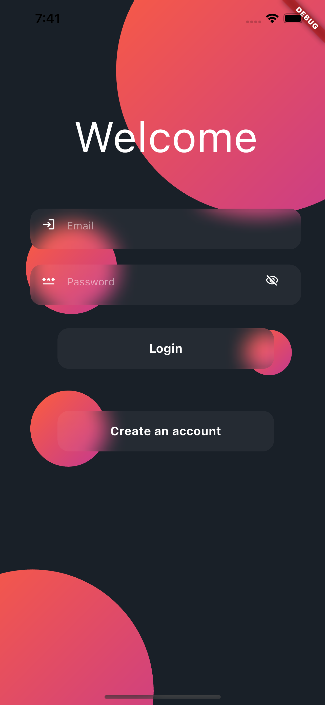
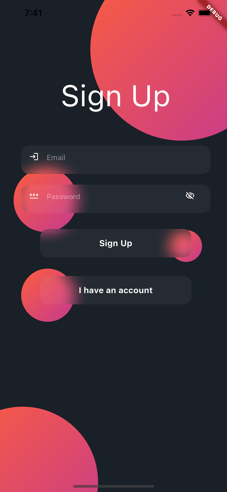
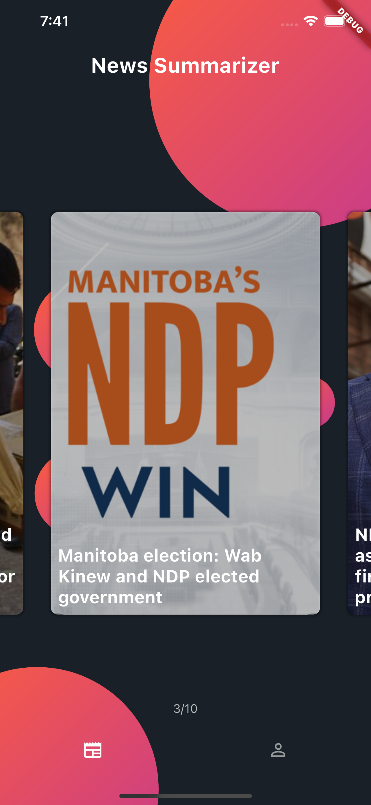
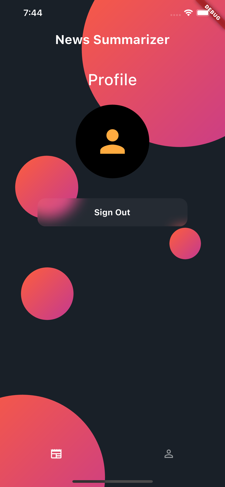

# News Summarizer GPT

The News Summarizer with ChatGPT is a powerful tool that leverages OpenAI's ChatGPT model to provide concise and human-like summaries of news articles. This project is designed to help individuals stay informed efficiently by condensing lengthy news articles into easily digestible summaries.


## Table of Contents

- [Screenshots](#screenshots)
- [Installation](#installation)


## Screenshots

*Login Screen*





*Sign up Screen*




*Home Screen*


*Home Screen*




*Card Details*


*Details Page*


*Profile*




## Installation

This is how to install the project and run it.
Change the *chatGPTApiKey* in the lib/src/app/app_environment.dart with your apiKey

```bash
$ git clone https://github.com/azizafif/news_gpt_app.git
$ cd news_gpt
$ flutter clean
$ flutter pub get

